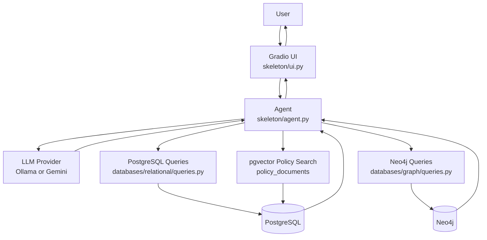
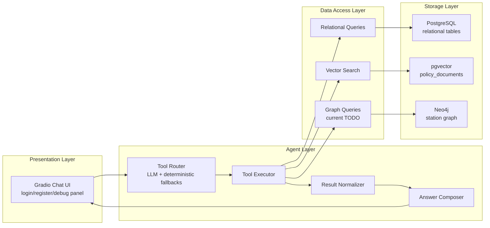
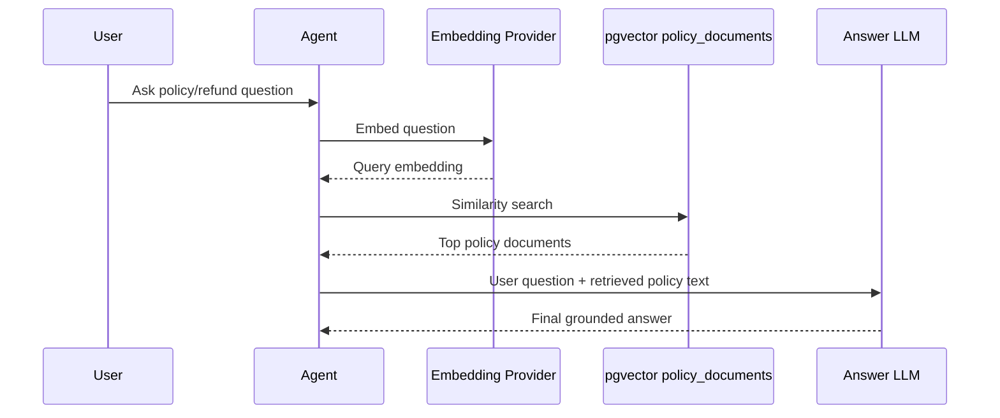
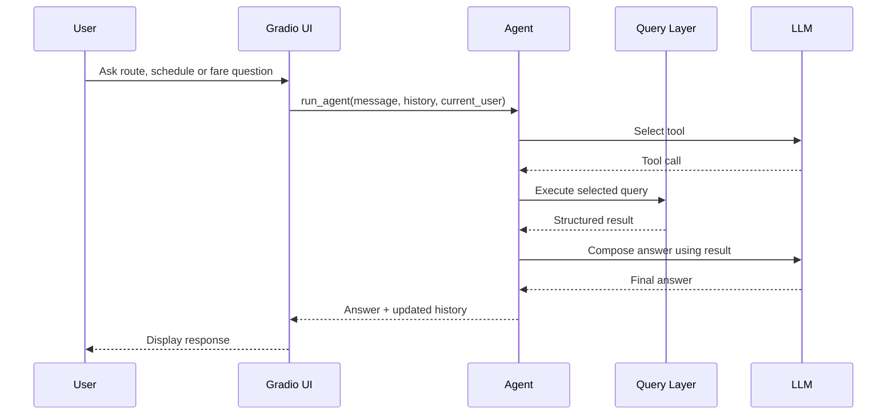

# TransitFlow System Design

## 1. System Overview

TransitFlow is an educational intelligent rail assistant. Users interact with a Gradio chat UI to ask about routes, schedules, fares, seats, refund policies, delay compensation, and personal travel history. After login, users can also make national rail bookings and cancel bookings.

The key design idea is to use different data models for different kinds of problems instead of forcing all data into one database:

- PostgreSQL relational database: structured operational data such as users, stations, schedules, seats, bookings, payments, and feedback.
- PostgreSQL + pgvector: semantic search over policy documents for RAG.
- Neo4j graph database: intended physical network model for metro / national rail routing, interchange paths, alternative routes, and delay ripple analysis.

The main request flow is:

Important current-state note: the relational and vector pipelines are implemented. The Neo4j seeder and graph query functions are still TODO skeletons, so graph route questions will fail or return errors until those functions are completed.

## 2. Requirements

### Functional Requirements

The system should support:

- Public national rail schedule, service type, seat availability, and fare queries.
- Public metro schedule and fare queries.
- Public route queries, including fastest route, cheapest route, alternative route, and interchange path.
- Public policy queries, including refund, delay compensation, ticket rules, luggage, bicycle, and conduct questions.
- User registration, login, logout, and password reset.
- Logged-in users can view their national rail bookings and metro trips.
- Logged-in users can create national rail bookings with explicit seat selection or automatic seat assignment.
- Logged-in users can cancel bookings, with booking and payment status updated according to refund logic.
- The UI can show a debug panel with tool selection, raw database results, and the data sent to the LLM.

### Non-Functional Requirements

- Understandability: the project is primarily for database and AI agent learning, so the design should be easy to read and extend.
- Data consistency: booking, payment, and seat availability logic must avoid duplicate seat booking and inconsistent transaction state.
- Security: use parameterized SQL; hash passwords and secret answers with Argon2id; normalize emails.
- Rebuildability: database state should be reproducible from schema files, seed scripts, and mock data.
- LLM flexibility: chat can use Ollama or Gemini; embeddings must match the vector dimension used when seeding.
- Observability: the debug panel should help developers understand tool calls and database results.

## 3. High-Level Architecture

TransitFlow has four main layers:

### Runtime / Deployment Layout

The Python app runs locally and connects to database containers from Docker Compose:

| Service | Source | Host Port | Container Port | Purpose |
|---|---|---:|---:|---|
| Gradio app | `skeleton/ui.py` | 7860 | n/a | Chat UI |
| PostgreSQL + pgvector | `docker-compose.yml` | 5400 | 5432 | Relational + vector database |
| Neo4j Browser | `docker-compose.yml` | 7475 | 7474 | Graph visualisation UI |
| Neo4j Bolt | `docker-compose.yml` | 7688 | 7687 | Python Neo4j driver connection |
| pgAdmin | `docker-compose.yml` | 5051 | 80 | PostgreSQL browser UI |

Note: `skeleton/config.py` defaults `PG_PORT` to `5432` and `NEO4J_URI` to `bolt://localhost:7687`. With the current `docker-compose.yml` from the host machine, `.env` should align these with `PG_PORT=5400` and `NEO4J_URI=bolt://localhost:7688`, unless a different local setup maps ports differently.

## 4. Core Components

### `skeleton/ui.py`

This is the Gradio frontend. It owns:

- Chat input and response display.
- Login, register, logout, and forgot-password panels.
- Current user state.
- Conversation history passed to the agent.
- Debug panel display.
- Runtime chat model dropdown for Ollama/Gemini chat selection.

The UI does not directly query application data except through imported authentication helper functions from `databases/relational/queries.py`. Normal chat messages go through `run_agent()`.

### `skeleton/agent.py`

This is the system brain. It owns:

- Station-name-to-ID injection, so phrases like "Central Station" can be converted into `NR01`.
- Tool definitions that tell the LLM which actions exist.
- Tool routing through Ollama native tool calling or a Gemini JSON routing prompt.
- Deterministic fallbacks for common route, schedule, and personal booking queries.
- Tool execution against relational, vector, and graph query functions.
- JSON result normalization into readable text.
- Final answer composition by the LLM.

The agent should not contain business data. It coordinates tools and treats databases as the source of truth.

### `databases/relational/queries.py`

This is the PostgreSQL access layer. It uses `psycopg2`, `RealDictCursor`, and a `ThreadedConnectionPool`.

Main responsibilities:

- National rail availability and fare queries.
- Metro schedule and fare queries.
- Available seat lookup and automatic seat selection.
- User profile and booking history.
- Booking creation with transaction handling.
- Booking cancellation with refund calculation.
- Registration, login, and password reset.
- Policy vector search and policy document storage.

Write operations use explicit transactions. Booking creation relies on serializable isolation plus a partial unique index to avoid double booking the same seat.

### `databases/graph/queries.py`

This is the intended Neo4j access layer. It should support:

- Fastest route by travel time.
- Cheapest route by estimated fare.
- Alternative routes that avoid a station.
- Cross-network interchange paths.
- Delay ripple analysis.
- Direct station connections.

Current state: the function signatures exist, but the implementation still raises `NotImplementedError`. Documentation and future work should treat Neo4j query support as target architecture, not completed behavior.

### Seed Scripts

The seed scripts rebuild local data from tracked files:

- `skeleton/seed_postgres.py`: loads station, schedule, seat, user, booking, trip, payment, and feedback data from `train-mock-data/`.
- `skeleton/seed_vectors.py`: builds policy documents from JSON policy files, embeds them with the configured provider, and stores them in `policy_documents`.
- `skeleton/seed_neo4j.py`: intended to load graph nodes and relationships from station JSON files. Current state: it contains TODO steps and does not yet create the graph.

## 5. Data Architecture

### Relational PostgreSQL

The relational schema in `databases/relational/schema.sql` models operational transit data.

Main groups:

- Users: `users`, `user_credentials`.
- Metro infrastructure: `metro_stations`, `metro_station_lines`, `metro_schedules`, `metro_schedule_days`.
- National rail infrastructure: `national_rail_stations`, `national_rail_station_lines`, `national_rail_schedules`, `national_rail_schedule_days`.
- Seats: `seat_layouts`, `coaches`, `seats`.
- Transactions: `bookings`, `metro_trips`, `payments`, `feedback`.

Important design choices:

- Metro and national rail trips are separate because national rail has advance booking and seat assignment, while metro is same-day tap-in style travel.
- Payment and feedback use an exclusive arc: each row points to either a national rail booking or a metro trip, but not both.
- Schedule stop order and travel times are stored as JSONB because queries usually read the whole ordered route.
- A partial unique index prevents active double booking for the same `schedule_id`, `travel_date`, `coach`, and `seat_id`.

### pgvector / RAG

The vector table is `policy_documents`.

Policy data comes from:

- `refund_policy.json`
- `ticket_types.json`
- `booking_rules.json`
- `travel_policies.json`

RAG flow:

Embedding dimension must match the provider:

- Ollama `nomic-embed-text`: `vector(768)`.
- Gemini `gemini-embedding-001`: `vector(3072)`.

The current schema uses `vector(768)`, which matches the default Ollama setup.

### Neo4j Graph

The intended graph model represents stations and physical links:

- `:Station:MetroStation` nodes for metro stations `MS01` to `MS20`.
- `:Station:NationalRailStation` nodes for rail stations `NR01` to `NR10`.
- `METRO_LINK` relationships between metro stations.
- `RAIL_LINK` relationships between national rail stations.
- `INTERCHANGE_TO` relationships between metro and national rail interchange stations.

Relationship properties should include travel or walking time, for example `travel_time_min` or `walking_time_min`.

Current state: this schema is described in `AI_SESSION_CONTEXT.md`, but `skeleton/seed_neo4j.py` and `databases/graph/queries.py` still need implementation.

## 6. Main User Flows

### Public Route or Fare Query

For metro fare, the agent queries metro schedules first, computes the number of stops between origin and destination, then calls metro fare calculation.

For graph route queries, the intended flow goes through Neo4j. The current implementation will not complete until graph query functions are implemented.

### Logged-In User Booking History

1. The user logs in through the UI.
2. The UI stores `current_user_state` as the user email.
3. The user asks "show my bookings".
4. The agent sees login context and calls `get_user_bookings()`.
5. `query_user_bookings(user_email)` returns both national rail bookings and metro trips.
6. The LLM writes a human-readable answer from the returned records.

### National Rail Booking

1. The user asks about a journey and date.
2. The agent checks availability before making a booking.
3. The user confirms booking details.
4. The agent calls `make_booking` only if the user is logged in.
5. `execute_booking()` validates the route, computes fare, selects or verifies a seat, and inserts the booking and payment in one transaction.
6. The booking result is returned to the user.

### Policy / Refund Query

1. The user asks about refunds, compensation, luggage, bicycles, ticket rules, or conduct.
2. The agent calls `search_policy`.
3. The active embedding provider embeds the user query.
4. PostgreSQL pgvector finds the closest policy documents.
5. The final LLM answer is grounded in the retrieved policy text.

## 7. Current Implementation Status

| Area | Status | Notes |
|---|---|---|
| Gradio UI | Implemented | Chat, auth panels, debug panel, and model selection exist. |
| Agent router | Implemented | LLM tool routing plus deterministic fallbacks exist. |
| Relational schema | Implemented | `databases/relational/schema.sql` defines the operational schema and vector table. |
| PostgreSQL seeding | Implemented | `skeleton/seed_postgres.py` loads mock operational data. |
| Relational query layer | Implemented | Availability, fare, seat, booking, cancellation, and auth functions exist. |
| Vector/RAG seeding | Implemented | `skeleton/seed_vectors.py` embeds policy JSON into pgvector. |
| Policy search | Implemented | `query_policy_vector_search()` searches `policy_documents`. |
| Neo4j seeding | Not implemented | `skeleton/seed_neo4j.py` still contains TODO comments. |
| Neo4j query layer | Not implemented | `databases/graph/queries.py` functions currently raise `NotImplementedError`. |
| README accuracy | Partially stale | README contains useful teaching material but some ports/status details do not match current files. |

## 8. How to Understand or Extend the System

### Mental Model

Think of TransitFlow as an LLM-controlled orchestrator over specialist data stores:

- The UI collects intent and user state.
- The agent decides which tool should answer the question.
- The query layer retrieves factual data.
- The LLM turns retrieved data into natural language.
- The databases remain the source of truth.

The LLM should not invent schedules, prices, bookings, or policies. It should answer from tool results.

### Extending Relational Features

To add a new structured capability:

1. Add or modify tables in `databases/relational/schema.sql`.
2. Update `skeleton/seed_postgres.py` if seed data is needed.
3. Add a query function in `databases/relational/queries.py`.
4. Add a tool definition and execution branch in `skeleton/agent.py`.
5. Test through the UI with the debug panel enabled.

### Extending Policy Knowledge

To add new policy knowledge:

1. Add entries to the relevant policy JSON file in `train-mock-data/`.
2. Re-run `skeleton/seed_vectors.py`.
3. Ask related questions in the UI and inspect debug output.

### Completing Graph Features

To finish the target graph architecture:

1. Implement `skeleton/seed_neo4j.py` to create station nodes and relationships.
2. Implement the six graph query functions in `databases/graph/queries.py`.
3. Ensure `.env` uses `NEO4J_URI=bolt://localhost:7688` for the current Compose setup.
4. Test route, alternative route, interchange, and delay ripple questions through the debug panel.

