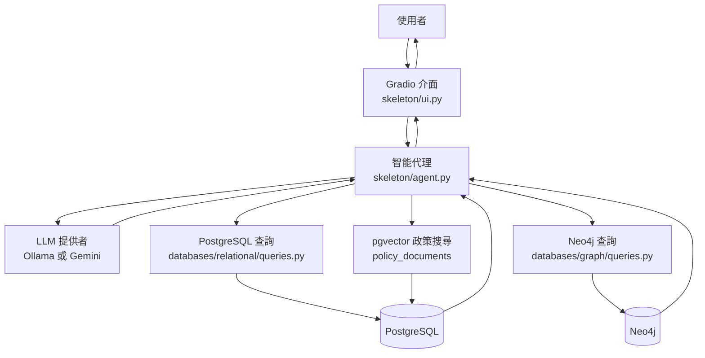
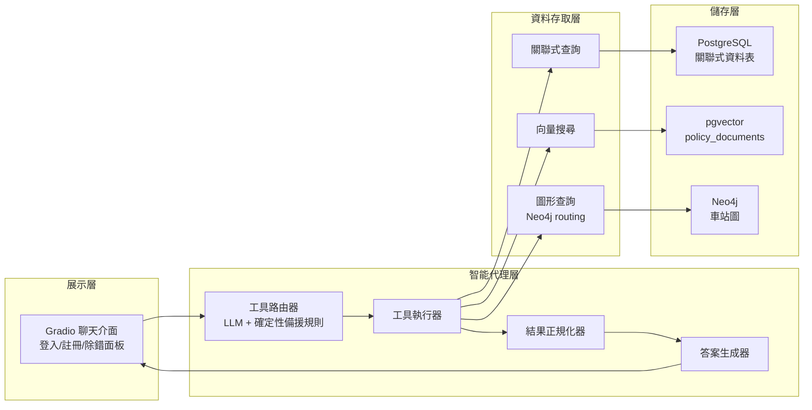
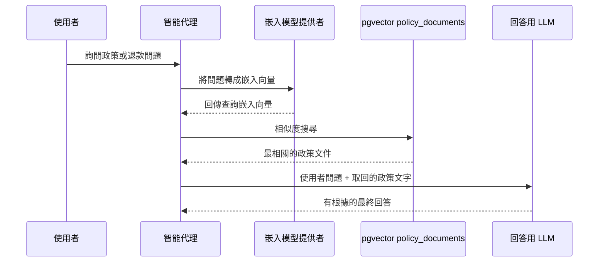
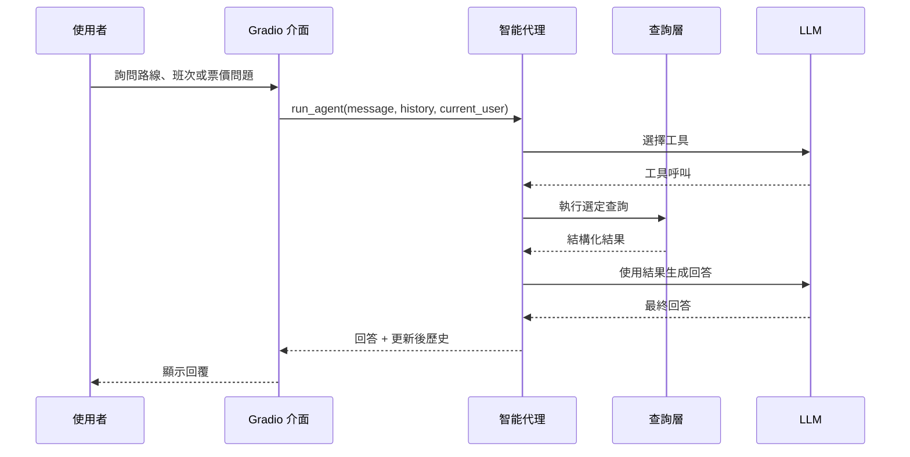

# TransitFlow 系統設計文件

## 1. 系統總覽

TransitFlow 是一個教學型智能鐵路助理。使用者透過 Gradio 聊天介面詢問捷運與國鐵的路線、班次、票價、座位、退票政策與延誤賠償；登入後也可以查詢個人訂票紀錄、建立國鐵訂票或取消訂票。

系統的核心概念是讓 LLM 負責理解問題與選工具，真正的事實資料則來自資料庫：

- PostgreSQL 關聯式資料庫：使用者、車站、班次、座位、訂票、捷運旅程、付款與意見回饋。
- PostgreSQL + pgvector：政策文件的語意搜尋，也就是 RAG 檢索。
- Neo4j 圖形資料庫：目標上用來表示捷運 / 國鐵實體網路，支援路線、替代路線、轉乘與延誤影響分析。

重要現況：關聯式資料庫、向量檢索流程、Neo4j 種子資料載入器與圖形查詢函式都已有實作。Neo4j 相關功能仍應在實際容器啟動並完成 seeding 後，用路線、轉乘與延誤影響問題做端到端驗證。

## 2. 需求

### 功能需求

- 公開查詢國鐵班次、服務類型、可用座位與票價。
- 公開查詢捷運班次與票價。
- 公開查詢路線，例如最快路線、最便宜路線、替代路線與轉乘路徑。
- 公開查詢政策，例如退款、延誤賠償、票種規則、行李、自行車與乘客行為規範。
- 使用者可註冊、登入、登出與重設密碼。
- 登入使用者可查詢自己的國鐵訂票與捷運旅程。
- 登入使用者可建立國鐵訂票，包含指定座位或自動分配座位。
- 登入使用者可取消訂票，系統根據退款邏輯更新訂票與付款狀態。
- UI 可顯示除錯面板，讓學生看到工具選擇、資料庫原始結果與送給 LLM 的資料。

### 非功能需求

- 可理解性：專案主要用於資料庫與 AI 智能代理教學，設計應容易閱讀與擴充。
- 資料一致性：訂票、付款與座位可用性必須避免重複訂位與交易狀態不一致。
- 安全性：使用參數化 SQL；密碼與秘密答案使用 Argon2id hash；email 正規化。
- 可重建性：資料庫狀態應能由 schema、種子資料腳本與 mock data 重新建立。
- 可切換 LLM：聊天模型可使用 Ollama 或 Gemini；嵌入模型提供者必須與已載入的向量維度一致。
- 可觀察性：除錯面板應幫助開發者理解 LLM 選了哪些工具與資料庫回傳什麼。

## 3. 高階架構

TransitFlow 分成四個主要層次：

### 執行與部署配置

Python 應用程式在本機執行，並連到 Docker Compose 啟動的資料庫容器：

| 服務 | 來源 | 主機 Port | 容器 Port | 用途 |
|---|---|---:|---:|---|
| Gradio 應用程式 | `skeleton/ui.py` | 7860 | n/a | 聊天介面 |
| PostgreSQL + pgvector | `docker-compose.yml` | 5400 | 5432 | 關聯式與向量資料庫 |
| Neo4j Browser | `docker-compose.yml` | 7475 | 7474 | 圖形資料庫視覺化介面 |
| Neo4j Bolt | `docker-compose.yml` | 7688 | 7687 | Python Neo4j driver 連線 |
| pgAdmin | `docker-compose.yml` | 5051 | 80 | PostgreSQL 瀏覽介面 |

注意：`skeleton/config.py` 預設 `PG_PORT=5432`、`NEO4J_URI=bolt://localhost:7687`。如果從主機端使用目前的 `docker-compose.yml`，`.env` 應對齊為 `PG_PORT=5400` 與 `NEO4J_URI=bolt://localhost:7688`，除非你的本機環境另有不同連接埠對應。

## 4. 核心元件

### `skeleton/ui.py`

Gradio 前端負責：

- 聊天輸入與回覆顯示。
- 登入、註冊、登出與忘記密碼面板。
- 目前使用者狀態。
- 傳給智能代理的對話歷史狀態。
- 除錯面板顯示。
- 執行期間可切換 Ollama/Gemini 聊天模型的下拉選單。

一般聊天訊息會送進 `run_agent()`；UI 只直接呼叫少量驗證輔助函式。

### `skeleton/agent.py`

智能代理負責：

- 車站名稱到 ID 的注入，例如把 "Central Station" 補成 `NR01`。
- 定義工具，讓 LLM 知道有哪些資料庫能力可以呼叫。
- 透過 Ollama 原生工具呼叫或 Gemini JSON 路由提示進行工具路由。
- 對常見路線、班次與個人訂票查詢提供確定性備援規則。
- 執行關聯式、向量與圖形查詢函式。
- 將 JSON 結果正規化為可讀文字。
- 讓 LLM 根據資料庫結果生成最終回答。

智能代理本身不應包含業務資料。它負責協調工具，資料庫才是事實來源。

### `databases/relational/queries.py`

PostgreSQL 資料存取層使用 `psycopg2`、`RealDictCursor` 與 `ThreadedConnectionPool`。

主要責任：

- 國鐵可用班次與票價查詢。
- 捷運班次與票價查詢。
- 可用座位查詢與自動選位。
- 使用者資料與訂票歷史。
- 使用交易處理建立訂票。
- 取消訂票並計算退款。
- 註冊、登入與密碼重設。
- 政策向量搜尋與政策文件儲存。

寫入操作使用明確交易。建立訂票時依靠可序列化隔離層級與 partial unique index，避免同一班車、同一天、同一座位被重複訂走。

### `databases/graph/queries.py`

這是 Neo4j 資料存取層，目前已提供：

- 依旅行時間尋找最快路線。
- 依估算票價尋找最便宜路線。
- 避開指定車站的替代路線。
- 跨網路轉乘路徑。
- 延誤影響範圍分析。
- 直接相連車站查詢。

目前狀態：查詢函式已有 Cypher 實作，會透過 Neo4j driver 執行最短路徑、替代路線、轉乘、延誤影響與直接連線查詢。這部分應搭配 `skeleton/seed_neo4j.py` 實際載入資料後驗證。

### 種子資料腳本

- `skeleton/seed_postgres.py`: 從 `train-mock-data/` 載入車站、班次、座位、使用者、訂票、旅程、付款與意見回饋資料。
- `skeleton/seed_vectors.py`: 從 JSON 政策檔建立政策文件，產生嵌入向量，並存入 `policy_documents`。
- `skeleton/seed_neo4j.py`: 從車站 JSON 檔載入捷運與國鐵節點，建立 `METRO_LINK`、`RAIL_LINK` 與 `INTERCHANGE_TO` 關係。

## 5. 資料架構

### PostgreSQL 關聯式資料

`databases/relational/schema.sql` 描述營運資料。

主要資料群組：

- 使用者：`users`, `user_credentials`。
- 捷運基礎資料：`metro_stations`, `metro_station_lines`, `metro_schedules`, `metro_schedule_days`。
- 國鐵基礎資料：`national_rail_stations`, `national_rail_station_lines`, `national_rail_schedules`, `national_rail_schedule_days`。
- 座位：`seat_layouts`, `coaches`, `seats`。
- 交易：`bookings`, `metro_trips`, `payments`, `feedback`。

重要設計選擇：

- 捷運與國鐵旅程分開建模，因為國鐵有預先訂票與座位分配，捷運則偏向當日進站搭乘紀錄。
- 付款與意見回饋使用互斥關聯：每列只能指向國鐵訂票或捷運旅程其中之一。
- partial unique index 防止同一個 `schedule_id`、`travel_date`、`coach`、`seat_id` 發生活躍狀態下的重複訂位。

### pgvector / RAG

向量資料表是 `policy_documents`。政策資料來源：

- `refund_policy.json`
- `ticket_types.json`
- `booking_rules.json`
- `travel_policies.json`

嵌入向量維度必須與 provider 相符：

- Ollama `nomic-embed-text`: `vector(768)`。
- Gemini `gemini-embedding-001`: `vector(3072)`。

目前 schema 使用 `vector(768)`，符合預設 Ollama 設定。

### Neo4j 圖形資料

目標圖形模型用來表示車站與實體連線：

- `:MetroStation` 節點表示 `MS01` 到 `MS20` 的捷運車站。
- `:NationalRailStation` 節點表示 `NR01` 到 `NR10` 的國鐵車站。
- `METRO_LINK` 關係表示捷運車站之間的連線。
- `RAIL_LINK` 關係表示國鐵車站之間的連線。
- `INTERCHANGE_TO` 關係表示捷運與國鐵轉乘站之間的連線。

目前 `skeleton/seed_neo4j.py` 會建立 `MetroStation` 與 `NationalRailStation` 節點，並建立 `METRO_LINK`、`RAIL_LINK`、`INTERCHANGE_TO` 關係；`databases/graph/queries.py` 會使用這些節點與關係執行路線查詢。

## 6. 主要使用者流程

### 公開路線或票價查詢

對捷運票價來說，智能代理會先查捷運班次，計算起點到終點之間的站數，再呼叫票價計算。對圖形路線查詢來說，流程會走 Neo4j；實際使用前需要先執行 `skeleton/seed_neo4j.py` 載入圖形資料。

### 登入使用者訂票歷史

1. 使用者透過 UI 登入。
2. UI 將 `current_user_state` 存成使用者 email。
3. 使用者詢問「顯示我的訂票」。
4. 智能代理讀到登入狀態後呼叫 `get_user_bookings()`。
5. `query_user_bookings(user_email)` 回傳國鐵訂票與捷運旅程。
6. LLM 根據回傳紀錄寫出人類可讀的回答。

### 國鐵訂票

1. 使用者詢問旅程與日期。
2. 智能代理在建立訂票前先檢查可用班次。
3. 使用者確認訂票細節。
4. 只有在使用者已登入時，智能代理才會呼叫 `make_booking`。
5. `execute_booking()` 驗證路線、計算票價、選擇或驗證座位，並在同一個交易中寫入訂票與付款。
6. 訂票結果回傳給使用者。

### 政策 / 退款查詢

1. 使用者詢問退款、賠償、行李、自行車、票種規則或乘客行為規範。
2. 智能代理呼叫 `search_policy`。
3. 目前的 LLM provider 將使用者問題轉成嵌入向量。
4. PostgreSQL pgvector 找出最相近的政策文件。
5. 最終 LLM 回答會根據取回的政策文字生成。

## 7. 目前實作狀態

| 範圍 | 狀態 | 備註 |
|---|---|---|
| Gradio 介面 | 已實作 | 已有聊天、驗證面板、除錯面板與模型選擇。 |
| Agent 路由器 | 已實作 | 已有 LLM 工具路由與確定性備援規則。 |
| 關聯式 schema | 已實作 | 已定義營運 schema 與向量資料表。 |
| PostgreSQL 種子資料載入 | 已實作 | `skeleton/seed_postgres.py` 會載入 mock 營運資料。 |
| 關聯式查詢層 | 已實作 | 已有可用性、票價、座位、訂票、取消與驗證函式。 |
| 向量/RAG 種子資料載入 | 已實作 | `skeleton/seed_vectors.py` 會把政策 JSON 嵌入到 pgvector。 |
| 政策搜尋 | 已實作 | `query_policy_vector_search()` 會搜尋 `policy_documents`。 |
| Neo4j 種子資料載入 | 已實作 | `skeleton/seed_neo4j.py` 會建立捷運/國鐵節點與三種關係。 |
| Neo4j 查詢層 | 已實作 | `databases/graph/queries.py` 已有路線、替代路線、轉乘、延誤影響與直接連線查詢。 |
| README 準確性 | 部分過時 | README 有有用的教學內容，但部分連接埠 / 狀態細節與目前檔案不一致。 |

## 8. 如何理解或擴充系統

可以把 TransitFlow 想成一個由 LLM 控制的協調器：

- UI 收集使用者意圖與登入狀態。
- 智能代理決定哪個工具適合回答問題。
- 查詢層從資料庫取回事實資料。
- LLM 把資料庫結果轉成自然語言回答。
- 資料庫保持為事實來源。

LLM 不應自行編造班次、價格、訂票或政策；它應該根據工具結果回答。

擴充關聯式資料功能時，通常需要改 `schema.sql`、`seed_postgres.py`、`queries.py`，再在 `agent.py` 加工具定義與執行分支。
